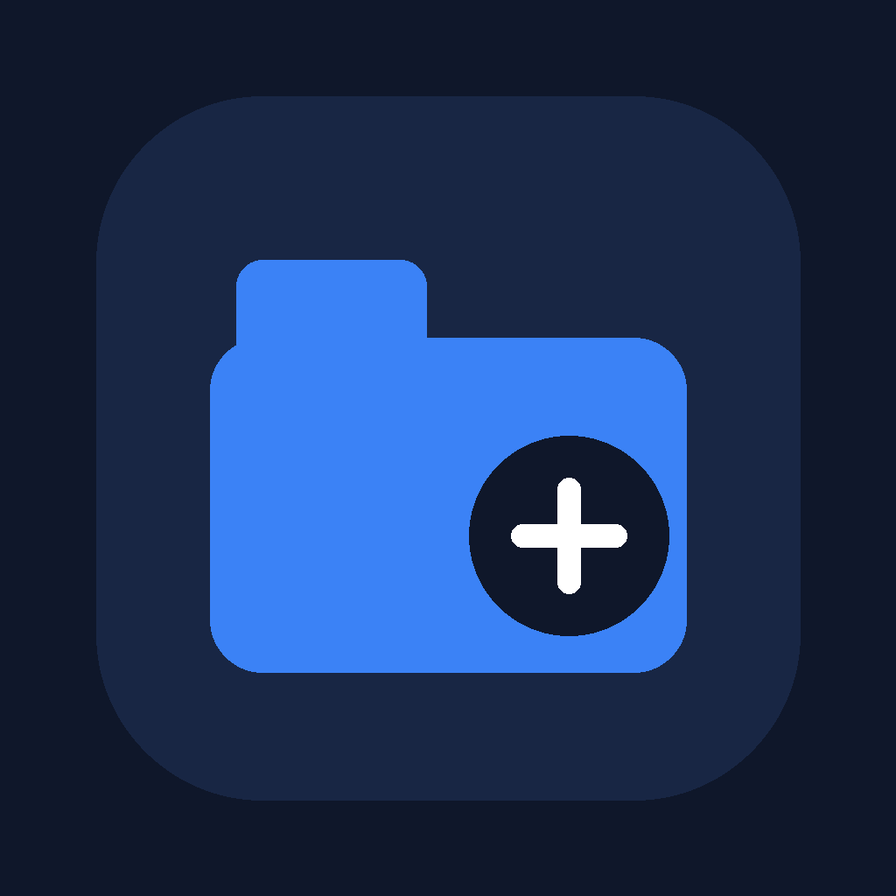

# Simple File Manager



Android için sade, çevrimdışı ve yerel çalışan bir dosya yöneticisi.

**Güncel sürüm:** `1.3.5`  
**Android versionCode:** `10`

## Özellikler

- Dahili depolama ve çıkarılabilir depolama birimlerini listeleme
- SD kart / desteklenen USB depolama birimlerini `Harici Depolama` olarak gösterme
- Dosya ve klasör oluşturma
- Ada, boyuta ve değişiklik tarihine göre sıralama
- Yeniden adlandırma
- Kopyalama ve taşıma
- Silme
- Uygun Android uygulamasıyla dosya açma
- Açık / koyu tema
- Dosya ve klasör görünüm boyutunu büyütme / küçültme
- Dikey ve yatay ekran desteği
- Android safe-area / çentik / navigasyon alanı uyumu
- Özel uygulama ikonu ve splash ekranı
- Türkçe arayüz

## Depolama modeli

Uygulama, Android 11 ve üzerindeki cihazlarda dosya yöneticisi işlevleri için `MANAGE_EXTERNAL_STORAGE` ("Tüm dosyalara erişim") iznini kullanır. Uygulama ilk kullanımda gerekli sistem ayarına yönlendirir.

Android'in platform düzeyinde koruduğu bazı alanlar (özellikle başka uygulamalara ait `Android/data` ve `Android/obb` alt dizinleri) cihaz ve Android sürümüne bağlı olarak erişime kapalı kalabilir.

Harici depolama cihazları Android tarafından bir `StorageVolume` olarak sunuluyorsa uygulamada görünür. Bazı USB OTG cihazlarında üreticiye bağlı olarak Storage Access Framework gerekebilir.

## Kurulum

En kolay yöntem, GitHub **Releases** bölümündeki son `.apk` dosyasını indirip Android cihazına kurmaktır.

Kaynak koddan APK üretmek için:

```bash
npm install
npx eas-cli@latest build -p android --profile release
```

> `npm install` yalnızca ilk kurulumda veya bağımlılıklar değiştiğinde gereklidir.

Google Play / AAB üretmek için:

```bash
npx eas-cli@latest build -p android --profile production
```

## Geliştirme

```bash
npm install
npx expo start
```

Proje Expo / React Native kullanır. Android dosya işlemleri `modules/simple-file-manager-native` altındaki yerel Expo modülü üzerinden gerçekleştirilir.

## Sürüm geçmişi

Ayrıntılar için [CHANGELOG.md](CHANGELOG.md) dosyasına bakın.

## Gizlilik

Uygulamanın amacı cihazdaki dosyaları yerel olarak yönetmektir. Projenin kendi uygulama mantığında reklam, kullanıcı hesabı, analitik veya buluta dosya yükleme özelliği bulunmaz. Ayrıntılar için [PRIVACY.md](PRIVACY.md) dosyasına bakın.

## Hata / özellik talebi

GitHub Issues üzerinden hata bildirimi veya özellik talebi açabilirsiniz.

E-posta: **bahadir@bahadiryildiz.net**

## Güvenlik

Güvenlik açığı bildirimleri için [SECURITY.md](SECURITY.md) dosyasını kullanın.

## Lisans

Bu depo herkese açık olmakla birlikte şu anda açık kaynak lisansı tanımlanmamıştır. Depoyu herkese açık yapmak tek başına kaynak kodun yeniden kullanım, değiştirme veya dağıtım hakkını vermez.

---

## English

Simple File Manager is a lightweight Android file manager focused on local file operations. It supports internal storage, removable storage when exposed by Android, create/rename/copy/move/delete operations, light/dark themes, landscape mode, and a native Android storage module.

For bug reports and feature requests, use GitHub Issues or contact **bahadir@bahadiryildiz.net**.
